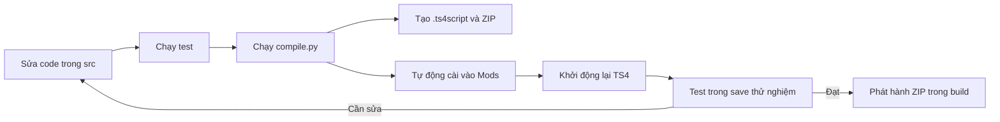

# Hướng dẫn end-to-end mod The Sims 4

Tài liệu này mô tả toàn bộ quy trình làm **script mod The Sims 4** trên Windows bằng workspace hiện tại: cấu hình, viết code, kiểm thử, build, cài vào game, phát triển nhanh, tra cứu mã game, đọc `.package`, đóng gói phát hành và xử lý lỗi.

Project được dùng trong tài liệu:

```text
C:\Users\tomis\TaiLieu\ModTS4
```

Mọi lệnh PowerShell bên dưới mặc định được chạy tại thư mục này.

## 1. Luồng làm việc tổng quát



Chu kỳ ngắn gọn dùng hằng ngày:

```powershell
cd C:\Users\tomis\TaiLieu\ModTS4
.\.venv\Scripts\python.exe -m pytest -q
.\.venv\Scripts\python.exe compile.py
```

Sau đó khởi động lại game và test mod trong một save riêng.

## 2. Hiểu đúng các loại mod

Workspace hỗ trợ hai thành phần thường gặp:

| Loại file | Mục đích | Vị trí source |
|---|---|---|
| `.ts4script` | Python/script mod: command, injection, gameplay logic | `src/` |
| `.package` | Tuning XML, STBL, hình ảnh, CAS, object và resource DBPF | `assets/` |

`compile.py` đóng gói code trong `src/` thành `.ts4script`, đồng bộ asset trong `assets/`, cài bản test vào Mods và tạo ZIP phát hành.

> Implementation hiện tại dùng `compile_full()`, vì vậy `.ts4script` chứa cả bytecode `.pyc` và source `.py`. Đây không phải hình thức ẩn mã nguồn.

## 3. Trạng thái môi trường hiện tại

Tại thời điểm tài liệu được tạo, máy đã được xác nhận với:

- The Sims 4: `1.126.73.1030`.
- Game: `C:\Program Files\EA Games\The Sims 4`.
- Mods: `C:\Users\tomis\Documents\Electronic Arts\The Sims 4\Mods`.
- Python: `3.7.9`, tương thích với project và runtime TS4 mục tiêu.
- Script Mods: đã bật.
- `pytest`, Pillow, CMake, MinGW, `pycdc`, `unpyc37`, `decompyle3` và `uncompyle6`: đã cài.
- Test suite: `314 passed` tại lần nghiệm thu gần nhất.

Sau mỗi lần EA cập nhật game, cần kiểm tra lại phiên bản, bật lại Script Mods nếu bị reset, chạy test và decompile lại game scripts.

## 4. Kiểm tra nhanh trước khi code

### 4.1 Mở PowerShell tại project

```powershell
cd C:\Users\tomis\TaiLieu\ModTS4
```

Không bắt buộc activate virtual environment. Cách ít lỗi nhất là gọi trực tiếp Python 3.7 của project:

```powershell
.\.venv\Scripts\python.exe --version
.\.venv\Scripts\python.exe -m pip --version
```

Kết quả Python phải là `3.7.x`.

Nếu muốn activate trong terminal hiện tại:

```powershell
& .\.venv\Scripts\Activate.ps1
```

Nếu PowerShell chặn script activate, vẫn dùng được các lệnh trực tiếp `.\.venv\Scripts\python.exe ...`; không cần đổi execution policy của toàn máy.

### 4.2 Kiểm tra cấu hình project

File local [settings.py](./settings.py) hiện chứa các giá trị chính:

```python
creator_name = "tomis"
mods_folder = r"C:\Users\tomis\Documents\Electronic Arts\The Sims 4\Mods"
game_folder = r"C:\Program Files\EA Games\The Sims 4"
num_threads = 10
decompiler_timeout = 30.0
devmode_parity = True
```

`settings.py` bị gitignore vì mỗi máy có đường dẫn riêng. Khi tạo workspace mới, copy `settings.py.example` thành `settings.py`, rồi sửa các giá trị trên.

### 4.3 Kiểm tra cài đặt trong game

1. Mở TS4.
2. Vào **Game Options > Other**.
3. Bật **Enable Custom Content and Mods**.
4. Bật **Script Mods Allowed**.
5. Apply Changes và khởi động lại game.

Script mod nên nằm tối đa một thư mục con dưới `Mods`. Workspace đang cài đúng cấu trúc:

```text
Mods/
└── tomis_ModTS4/
    ├── tomis_ModTS4.ts4script
    └── *.package
```

Không lồng thêm nhiều lớp thư mục quanh `.ts4script`.

## 5. Cấu trúc project

```text
ModTS4/
├── src/                         # Code mod của bạn
│   ├── main.py
│   └── helpers/
├── assets/                      # .package và asset phát hành
├── build/                       # Output build, được tạo lại tự động
├── decompile/
│   ├── input/                   # Zip/ts4script cần decompile thủ công
│   └── output/python/           # Source game đã decompile
├── game_mods/                   # Command hỗ trợ dev mode/debug
├── tests/                       # Test suite
├── util/                        # Build, watcher, decompiler, datamining
├── settings.py                  # Cấu hình local, không commit
├── compile.py                   # Build + cài Mods + bundle
├── devmode.py                   # Đồng bộ source live
├── decompile.py                 # Decompile Python game
└── datamine.py                  # Đọc/extract .package
```

Nguyên tắc phân chia:

- Đặt code game trong `src/`.
- Mỗi package Python trong `src/` nên có `__init__.py`.
- Đặt `.package` cần phát hành trực tiếp trong `assets/`, không đặt ở thư mục con.
- Không sửa `decompile/output/python/`; đây là reference có thể được tạo lại.
- Không sửa file game gốc trong `C:\Program Files\EA Games\The Sims 4`.

## 6. Viết script mod đầu tiên

Workspace đã có command mẫu trong [src/main.py](./src/main.py):

```python
import sims4.commands
import services


@sims4.commands.Command(
    "helloworld",
    command_type=sims4.commands.CommandType.Live,
)
def helloworld(_connection=None):
    output = sims4.commands.CheatOutput(_connection)
    output("This is my first script mod")

    sim_info_manager = services.sim_info_manager()
    active_sim_info = sim_info_manager.get_active_sim_info()
    if active_sim_info is not None:
        output("Active Sim: {}".format(active_sim_info))
    else:
        output("No active Sim found")
```

Ý nghĩa:

- `@sims4.commands.Command(...)` đăng ký lệnh cheat trong game.
- `CommandType.Live` cho phép gọi lệnh khi đang chơi.
- `_connection` do game truyền vào.
- `CheatOutput` ghi text ra cheat console.
- `services.sim_info_manager()` truy cập service quản lý Sim.

Nên đặt prefix riêng cho command thật để tránh trùng với mod khác:

```python
@sims4.commands.Command(
    "tomis.hello",
    command_type=sims4.commands.CommandType.Live,
)
def tomis_hello(_connection=None):
    output = sims4.commands.CheatOutput(_connection)
    output("Xin chào từ mod của tomis")
```

### 6.1 Giới hạn Python 3.7

TS4 và workspace này yêu cầu code tương thích Python 3.7. Không dùng syntax của Python mới hơn:

- Không dùng `match/case`.
- Không dùng walrus operator `:=`.
- Không dùng type hint `list[str]`; dùng `typing.List[str]`.
- Không dùng positional-only parameter `/`.
- Không dùng API thư viện chỉ có trong Python 3.8+.

F-string, `pathlib`, `typing.List` và `dataclasses` cơ bản có thể dùng trong Python 3.7.

IDE báo `ModuleNotFoundError: sims4` khi chạy `src/main.py` ngoài game là bình thường. Module `sims4`, `services`, `objects`... chỉ tồn tại trong Python runtime của TS4. Không chạy trực tiếp `src/main.py` bằng Python desktop.

### 6.2 Tạo package Python mới

Ví dụ:

```text
src/
├── main.py
└── tomis_features/
    ├── __init__.py
    └── commands.py
```

Trong `main.py`:

```python
from tomis_features import commands
```

File `__init__.py` giúp import path giống nhau giữa dev mode và compiled mode. Giữ `devmode_parity = True` để giảm khác biệt giữa hai chế độ.

## 7. Chạy test

Trước mỗi build quan trọng:

```powershell
.\.venv\Scripts\python.exe -m pytest -q
```

Chạy riêng một file:

```powershell
.\.venv\Scripts\python.exe -m pytest tests\test_compile.py -q
```

Chạy theo từ khóa:

```powershell
.\.venv\Scripts\python.exe -m pytest -q -k compile
```

Test desktop không thay thế test trong game. Nên tách logic Python thuần khỏi code phụ thuộc `sims4` để unit test dễ hơn; mock game API tại biên tích hợp khi cần.

Kiểm tra source vẫn compile được bằng Python 3.7:

```powershell
.\.venv\Scripts\python.exe -m compileall -q src util
```

## 8. Build và cài mod vào game

Đóng game trước lần build cần test chính thức, sau đó chạy:

```powershell
.\.venv\Scripts\python.exe compile.py
```

`compile.py` thực hiện liên tiếp:

1. Xóa build cũ.
2. Thoát dev mode nếu folder `Scripts/` đang tồn tại.
3. Compile/đóng gói `src/` thành `.ts4script`.
4. Copy `.ts4script` vào Mods.
5. Đồng bộ asset từ `assets/` vào Mods và `build/`.
6. Tạo ZIP phát hành.

Output mong đợi:

```text
build/
├── tomis_ModTS4.ts4script
└── tomis_ModTS4.zip
```

Bản test được cài tự động tại:

```text
C:\Users\tomis\Documents\Electronic Arts\The Sims 4\Mods\tomis_ModTS4\tomis_ModTS4.ts4script
```

Console phải có các dòng gần giống:

```text
Made .ts4script in build/ and the mod folder
Complete
Synced packages: ...
Created final mod zip at: ...
```

> `compile.py` bắt exception và in traceback nhưng có thể không trả exit code lỗi. Luôn đọc output và xác nhận file trong `build/` có timestamp mới.

## 9. Test mod trong game

1. Đảm bảo TS4 đã tắt khi build.
2. Chạy `compile.py`.
3. Mở TS4 lại.
4. Xác nhận mod xuất hiện trong danh sách script mod lúc startup.
5. Load một save test và vào playable lot.
6. Nhấn `Ctrl+Shift+C`.
7. Gõ `helloworld` hoặc command đã đăng ký.

Kết quả mod mẫu:

```text
This is my first script mod
Active Sim: ...
```

Nếu không có active Sim, command trả `No active Sim found`; đây không phải lỗi load mod.

Dùng save test riêng cho mod có thay đổi gameplay, inventory, statistic, relationship hoặc persistence. Không test lần đầu trên save chính.

### 9.1 Log cần xem khi lỗi

Kiểm tra thư mục:

```text
C:\Users\tomis\Documents\Electronic Arts\The Sims 4\
```

Các file thường hữu ích:

- `lastException.txt`
- `lastUIException.txt` nếu có
- `lastCrash.txt` nếu có
- `Config.log`

Tìm tên module, command hoặc creator prefix trong traceback. Lỗi ở một mod khác cũng có thể chặn quá trình load.

## 10. Chu kỳ phát triển thông thường

Đây là chu kỳ ổn định nhất:

1. Sửa code trong `src/`.
2. Chạy unit test liên quan.
3. Tắt game.
4. Chạy `compile.py`.
5. Mở game và test.
6. Đọc `lastException.txt` nếu lỗi.
7. Lặp lại.

Với thay đổi đăng ký command, decorator, injection, import graph hoặc tuning, nên khởi động lại game hoàn toàn.

## 11. Dev mode và reload nhanh

Dev mode copy source Python trực tiếp vào:

```text
Mods\tomis_ModTS4\Scripts\
```

Khởi động dev mode:

```powershell
.\.venv\Scripts\python.exe devmode.py
```

Giữ terminal này mở. Watcher kiểm tra thay đổi mỗi giây và copy file mới/sửa vào Mods.

Trong cheat console:

```text
devmode.reload
devmode.reload main
devmode.reload tomis_features.commands
devmode.reload tomis_features
```

- Không có tham số: reload toàn bộ `.py` trong `Scripts/`.
- Đường dẫn module: reload một file.
- Đường dẫn folder: reload tất cả `.py` trong folder.

Quy trình:

1. Chạy `devmode.py` trước khi mở game.
2. Mở game và vào lot.
3. Sửa/lưu file trong `src/`.
4. Chờ terminal báo `Updated file`.
5. Gõ `devmode.reload ...` trong game.
6. Test thay đổi.

Giới hạn của hot reload:

- Reload không hoàn tác registration hoặc injection cũ.
- Decorator có thể bị đăng ký lặp khi reload nhiều lần.
- Đổi tên/xóa file trong `src/` không chắc xóa bản cũ trong `Scripts/` khi watcher đang chạy.
- `.package`, tuning, import structure và state đã tạo thường cần restart game.
- Nếu hành vi bất thường, dừng reload và khởi động lại game.

Nhấn `Ctrl+C` để dừng watcher. Sau khi dừng dev mode, luôn chạy lại:

```powershell
.\.venv\Scripts\python.exe compile.py
```

Lệnh này đảm bảo folder `Scripts/` và dev command được thay bằng compiled mod. Trước khi phát hành, bắt buộc test bản compiled, không chỉ test dev mode.

## 12. Thêm `.package` và nội dung tiếng Việt

Đặt `.package` cần phát hành trực tiếp trong:

```text
assets/
```

Ví dụ:

```text
assets/
├── tomis_mod_tuning.package
└── tomis_mod_strings.package
```

Sau đó chạy `compile.py`. File được copy vào cả `build/` và `Mods\tomis_ModTS4\`.

Không đặt asset trong folder con vì sync hiện tại chỉ đọc top-level. Đặt tên file duy nhất để tránh ghi đè asset khác.

Workspace đọc và extract `.package`, nhưng không có editor DBPF để author tuning/STBL hoàn chỉnh. Thường dùng Sims 4 Studio để:

- Tạo tuning override hoặc custom tuning.
- Tạo STBL/localization resource.
- Import icon/hình ảnh.
- Tạo CAS/object resource.

Nếu mod hiển thị text tiếng Việt:

- Source `.py` được lưu UTF-8 và có thể chứa chuỗi Unicode.
- Nên dùng STBL cho text UI có localization thay vì hardcode trong Python.
- TS4 không có locale tiếng Việt chính thức; nếu người chơi dùng `en_US`, cần đặt chuỗi tiếng Việt vào STBL của locale mà mod hỗ trợ/test.
- Giữ key/hash STBL ổn định khi cập nhật mod.
- `datamine.py` đọc được STBL game, nhưng cần Sims 4 Studio hoặc công cụ tương đương để tạo/sửa `.package` phát hành.

Sau khi sửa `.package`, khởi động lại game; `devmode.reload` không reload resource DBPF.

## 13. Tra cứu Python API của game

Game scripts đã decompile nằm tại:

```text
decompile\output\python\
├── base\
├── core\
├── generated\
└── simulation\
```

Tìm một API bằng ripgrep:

```powershell
rg -n "sim_info_manager" decompile\output\python
rg -n "@sims4.commands.Command" decompile\output\python
rg -n "class .*Service" decompile\output\python\simulation
```

Decompiler có thể tạo code không hoàn chỉnh. Dùng source decompile để hiểu tên module, signature và flow; không mặc định mọi dòng đều chạy lại được.

Sau khi EA cập nhật TS4, decompile lại:

```powershell
.\.venv\Scripts\python.exe decompile.py --game
```

Lệnh có thể mất nhiều thời gian. Một số file rơi vào output `pycdc (incomplete)` là bình thường.

Để decompile `.zip` hoặc `.ts4script` riêng:

1. Đặt file vào `decompile\input\`.
2. Chạy:

```powershell
.\.venv\Scripts\python.exe decompile.py --folder
```

### 13.1 Decompile một mod đã cài trong Mods

Dùng `--mod` với đường dẫn tới **thư mục gốc của mod**, không trỏ trực tiếp tới file `.ts4script`:

```powershell
.\.venv\Scripts\python.exe decompile.py --mod `
  "C:\Users\tomis\Documents\Electronic Arts\The Sims 4\Mods\SimRealist_-_SimNationalBank_3.2.1.1"
```

Workflow sẽ tìm đệ quy mọi `.ts4script` và `.zip`, lấy nguyên tên thư mục mod làm tên output, rồi tạo:

```text
decompile\output\mods\SimRealist_-_SimNationalBank_3.2.1.1\
├── manifest.json
└── python\
    └── SimRealist_-_SimNationalBank_3.2.1.1\
        └── ... source .py đã decompile
```

`manifest.json` ghi:

- Đường dẫn thư mục mod nguồn.
- Danh sách `.ts4script`/`.zip` đã phát hiện.
- Danh sách `.package` đi kèm.
- Vị trí output Python.

`.package` không chứa bytecode Python nên không được đưa qua decompiler. Để xem resource của package cùng mod:

```powershell
.\.venv\Scripts\python.exe datamine.py info `
  "C:\Users\tomis\Documents\Electronic Arts\The Sims 4\Mods\SimRealist_-_SimNationalBank_3.2.1.1\SimRealist_-_SimNationalBank_3.2.1.1.package"
```

Chạy lại `--mod` sẽ thay thế riêng thư mục output đã sinh của mod đó để không giữ source cũ sau khi mod cập nhật. Không lưu ghi chú cá nhân bên trong output generated; đặt ghi chú ở một thư mục khác.

Chỉ phân tích mod mà bạn có quyền xem/sửa và tôn trọng giấy phép của tác giả.

## 14. Datamining `.package`

### 14.1 Xem thông tin package

```powershell
.\.venv\Scripts\python.exe datamine.py info `
  "C:\Program Files\EA Games\The Sims 4\Data\Client\Strings_ENG_US.package"
```

Lệnh in version DBPF, số entry và các resource type.

### 14.2 Extract tuning từ một package

```powershell
.\.venv\Scripts\python.exe datamine.py extract `
  "C:\duong-dan\mod.package" `
  -o ".\extraction\single-package"
```

### 14.3 Extract resource trong toàn game

Mặc định extract tuning, strings và hình ảnh:

```powershell
.\.venv\Scripts\python.exe datamine.py extract-all `
  "C:\Program Files\EA Games\The Sims 4" `
  -o ".\extraction\game"
```

Chỉ extract STBL:

```powershell
.\.venv\Scripts\python.exe datamine.py extract-all `
  "C:\Program Files\EA Games\The Sims 4" `
  -o ".\extraction\strings" `
  --types STBL
```

Chỉ extract tuning và PNG:

```powershell
.\.venv\Scripts\python.exe datamine.py extract-all `
  "C:\Program Files\EA Games\The Sims 4" `
  -o ".\extraction\selected" `
  --types CombinedTuning PNG
```

Extract `all` có thể tạo rất nhiều file và tốn dung lượng. Bắt đầu bằng `STBL`, `CombinedTuning` hoặc một type ID cụ thể. Danh sách type nằm trong [RESOURCE_TYPES.md](./RESOURCE_TYPES.md).

Output thông minh gồm:

- `xml/`: tuning tách thành từng file.
- `strings.json`: STBL đã merge.
- `images/`: DDS/DST chuyển sang PNG.
- Folder type ID: raw `.bin` cho resource khác.

Không ghi output extraction vào `assets/`; chỉ copy resource đã chọn và đóng gói đúng thành `.package` phát hành vào đó.

## 15. Type hints và debug nâng cao

### 15.1 Type hints

Sau khi game scripts đã decompile, có entry point:

```powershell
.\.venv\Scripts\python.exe type_hints.py
```

Đây là workflow nâng cao: script có thể cài dependency riêng, tạo/đưa `proto_finder` vào Mods và xử lý protobuf của game. Không cần chạy để làm command mod cơ bản. Commit hoặc backup code trước khi thay đổi output type hints.

### 15.2 PyCharm Professional debugger

Chỉ dùng nếu có PyCharm Professional và debug egg phù hợp.

1. Sửa `pycharm_pro_folder` trong `settings.py` theo bản PyCharm đang cài.
2. Trong PyCharm tạo **Python Debug Server**:
   - Host: `localhost`
   - Port: `5678`
3. Chạy:

```powershell
.\.venv\Scripts\python.exe debug_setup.py
```

4. Start debug server trong PyCharm.
5. Mở game, vào lot và gõ:

```text
pycharm.debug
```

6. Khi debug xong, gỡ capability vì nó có thể làm chậm game:

```powershell
.\.venv\Scripts\python.exe debug_teardown.py
```

## 16. Đóng gói và phát hành

Trước release:

1. Tăng version mod theo cách bạn quản lý.
2. Chạy toàn bộ test.
3. Tắt game.
4. Chạy `compile.py`.
5. Xóa/đổi tên file trong `assets/` nếu không còn phát hành, rồi build lại.
6. Mở game và test **compiled mode** trên save test.
7. Kiểm tra startup mod list và `lastException.txt`.
8. Test với phiên bản TS4 hiện tại và pack dependency tối thiểu.
9. Mở ZIP để xác nhận chỉ có các file cần phát hành.

Lệnh release:

```powershell
.\.venv\Scripts\python.exe -m pytest -q
.\.venv\Scripts\python.exe compile.py
```

Artifact để upload:

```text
build\tomis_ModTS4.zip
```

Người dùng extract nội dung ZIP vào:

```text
Documents\Electronic Arts\The Sims 4\Mods\tomis_ModTS4\
```

Release note nên ghi:

- Version mod.
- Version TS4 đã test.
- Pack bắt buộc.
- Mod dependency/framework bắt buộc.
- Hướng dẫn cài và gỡ.
- Known issues.
- Cảnh báo backup save nếu mod thay đổi persistent data.

## 17. Cleanup và gỡ mod

Script có sẵn:

```powershell
.\.venv\Scripts\python.exe cleanup.py
```

> Giới hạn hiện tại: `cleanup.py` xóa debug setup, folder dev-mode `Scripts/` và `build/`, nhưng implementation hiện tại **không đảm bảo xóa toàn bộ** `.ts4script`/`.package` đã cài trong `Mods\tomis_ModTS4`.

Để gỡ mod hoàn toàn:

1. Tắt game.
2. Chạy `cleanup.py` nếu đang dùng dev/debug mode.
3. Mở File Explorer.
4. Xóa đúng folder:

```text
C:\Users\tomis\Documents\Electronic Arts\The Sims 4\Mods\tomis_ModTS4
```

5. Nếu đang xử lý cache lỗi sau khi gỡ/cập nhật mod, có thể xóa `localthumbcache.package` trong folder The Sims 4 khi game đã tắt. Game sẽ tạo lại file này.

Không xóa toàn bộ folder `The Sims 4`, `Mods` hoặc save game.

## 18. Xử lý lỗi thường gặp

### Mod không xuất hiện trong startup list

Kiểm tra:

- **Enable Custom Content and Mods** đã bật.
- **Script Mods Allowed** đã bật.
- Đã restart game sau khi bật option.
- `.ts4script` nằm tại `Mods\tomis_ModTS4\`, không bị lồng quá sâu.
- File không bị đổi thành `.ts4script.zip`.
- Bản build có timestamp mới.

### Cheat báo `Unknown command`

Nguyên nhân thường gặp:

- Game chưa restart sau build.
- Script mod bị tắt sau EA update.
- Module import lỗi trước khi decorator đăng ký command.
- Command bị trùng tên với mod khác.
- Chưa vào playable lot.

Đọc `lastException.txt`, đổi command sang prefix riêng và test lại với chỉ mod của bạn nếu cần.

### `ModuleNotFoundError: sims4` trong terminal/IDE

Đây là bình thường nếu chạy mod source bằng Python desktop. `sims4` chỉ có trong game. Dùng source decompile/type hints cho autocomplete; unit test logic thuần bằng mock.

### Build có traceback nhưng terminal không báo exit code lỗi

`compile.py` đang catch exception. Đọc toàn bộ output, sửa lỗi, rồi xác nhận các file sau có timestamp mới:

```text
build\tomis_ModTS4.ts4script
build\tomis_ModTS4.zip
Mods\tomis_ModTS4\tomis_ModTS4.ts4script
```

### Dev mode không thấy code mới

- Xem terminal có dòng `Updated file` không.
- Lưu file và chờ watcher tối đa một giây.
- Gõ đúng module path, ví dụ `devmode.reload main`.
- Nếu vừa xóa/đổi tên file, dừng dev mode và chạy lại.
- Nếu sửa decorator/injection/import, restart game.

### Game lỗi sau khi thêm `.package`

- Di chuyển package mới ra khỏi `assets/`, build lại và test.
- Xác nhận tuning/resource ID không trùng.
- Xác nhận pack dependency.
- Xóa `localthumbcache.package` khi game đã tắt.
- Test trên save riêng và đọc exception log.

### Decompile có file incomplete

Không phải mọi bytecode TS4 đều decompile hoàn hảo. So sánh output của module liên quan, đọc call site xung quanh và xác minh behavior trong game. Không dựa vào một đoạn decompile lỗi làm contract duy nhất.

### Lỗi sau EA update

Quy trình phục hồi:

1. Tắt game và backup save/mod source.
2. Để EA hoàn tất update/repair.
3. Mở game một lần không có mod nếu cần.
4. Bật lại Script Mods.
5. Chạy `pytest`.
6. Chạy `decompile.py --game`.
7. Build lại mod.
8. Test trên save riêng.
9. Cập nhật API/tuning đã thay đổi.

## 19. Checklist hằng ngày

Trước khi code:

- [ ] Đang ở đúng project.
- [ ] Dùng Python 3.7 của `.venv`.
- [ ] Game đã tắt nếu sắp build.
- [ ] Source/save quan trọng đã backup hoặc commit.

Trước khi test game:

- [ ] Test liên quan đã pass.
- [ ] `compile.py` không có traceback.
- [ ] Artifact có timestamp mới.
- [ ] Script Mods đang bật.
- [ ] Đang dùng save test.

Trước khi release:

- [ ] Full suite pass.
- [ ] Đã test compiled mode sau khi restart game.
- [ ] Không còn dev `Scripts/` trong mod folder.
- [ ] ZIP chỉ có artifact cần phát hành.
- [ ] Đã ghi version TS4, pack dependency và known issues.
- [ ] Đã test cài mới từ ZIP như một người dùng.

## 20. Bảng lệnh tham chiếu

| Mục đích | Lệnh |
|---|---|
| Kiểm tra Python | `.\.venv\Scripts\python.exe --version` |
| Chạy test | `.\.venv\Scripts\python.exe -m pytest -q` |
| Build + cài + bundle | `.\.venv\Scripts\python.exe compile.py` |
| Đồng bộ asset | `.\.venv\Scripts\python.exe sync_packages.py` |
| Tạo lại ZIP | `.\.venv\Scripts\python.exe bundle_build.py` |
| Dev mode | `.\.venv\Scripts\python.exe devmode.py` |
| Decompile game | `.\.venv\Scripts\python.exe decompile.py --game` |
| Decompile input | `.\.venv\Scripts\python.exe decompile.py --folder` |
| Decompile mod đã cài | `.\.venv\Scripts\python.exe decompile.py --mod "<thư-mục-mod>"` |
| Xem package | `.\.venv\Scripts\python.exe datamine.py info "<file.package>"` |
| Extract package | `.\.venv\Scripts\python.exe datamine.py extract "<file.package>" -o "<output>"` |
| Extract game data | `.\.venv\Scripts\python.exe datamine.py extract-all "<game>" -o "<output>"` |
| Cài debug PyCharm | `.\.venv\Scripts\python.exe debug_setup.py` |
| Gỡ debug PyCharm | `.\.venv\Scripts\python.exe debug_teardown.py` |
| Cleanup workspace | `.\.venv\Scripts\python.exe cleanup.py` |

Quy tắc cuối cùng: mỗi lần thay đổi code game, hãy kiểm tra cả unit test, compiled artifact và behavior trong TS4. Chỉ một trong ba lớp này pass chưa đủ để kết luận mod sẵn sàng phát hành.
